# EQ Mount DIY Go-To Kit

A DIY equatorial-telescope mount conversion: an **Arduino Mega 2560 + CNC Shield V3 + two NEMA17
steppers** turn an EQ3-2-class mount into a computer-controlled go-to/tracking mount, driven from
a **Python/Qt desktop GUI** with a live OpenGL sky map.

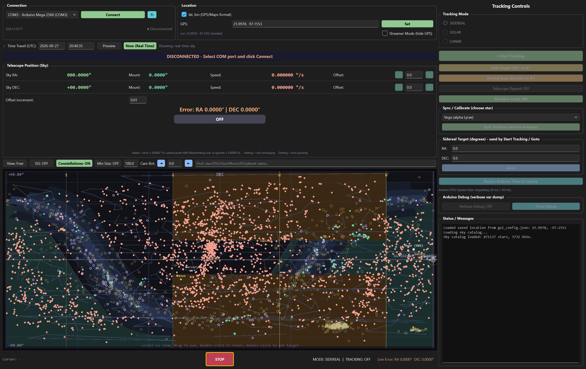

The GUI computes where everything in the sky is (871,137-star catalog, all Messier + thousands
more DSOs, constellations, Milky Way, Sun/Moon/planets via the JPL DE421 ephemeris, the ISS
via live TLE propagation, and SpaceX Dragon / Starship from SpaceX's live vehicle-tracker feeds),
lets you pick a target by name or coordinates, and commands the
firmware over USB serial to slew there and then track it - sidereal, solar or lunar rate. The
firmware does all the motion control on-board: interrupt-driven step generation, acceleration
ramps, gear-ratio/backlash compensation, mount-relative calibration, EEPROM persistence of your
location, and a set of hardware-independent safety features.

- GUI version: `1.0.19` (Python, PySide6/Qt)
- Firmware version: `1.8.54` (Arduino Mega 2560)
- All coordinates in this repo (defaults, config, logs, tests) point at
  **SpaceX Starbase, Boca Chica, Texas (25.9978, -97.1553)** - set your own in the GUI.

---

## Table of contents

**Part 1 - Using the software**

1. [What you need](#1-what-you-need)
2. [Installation](#2-installation)
3. [Setting your location](#3-setting-your-location)
4. [Launching](#4-launching)
5. [Connecting to the mount](#5-connecting-to-the-mount)
6. [The sky map](#6-the-sky-map)
7. [Tracking controls](#7-tracking-controls)
8. [Sync / Calibrate](#8-sync--calibrate)
9. [Targets, Goto and offsets](#9-targets-goto-and-offsets)
10. [Time Travel](#10-time-travel)
11. [Safety features](#11-safety-features)
12. [A typical session](#12-a-typical-session)
13. [Troubleshooting](#13-troubleshooting)

**Part 2 - Technical reference**

14. [System architecture](#14-system-architecture)
15. [Python side](#15-python-side)
16. [Astronomy pipeline](#16-astronomy-pipeline)
17. [Firmware design](#17-firmware-design)
18. [Serial protocol](#18-serial-protocol)
19. [EEPROM persistence](#19-eeprom-persistence)
20. [Tuning constants](#20-tuning-constants)
21. [Files, config and logs](#21-files-config-and-logs)
22. [Testing](#22-testing)
23. [Versioning conventions](#23-versioning-conventions)

---

# Part 1 - Using the software

## 1. What you need

**Hardware (this project's build):**

- An equatorial mount with a motorisable worm drive - this repo is built and tuned for a
  SkyScan 2001 (rebadged Skywatcher EQ3-2): RA worm wheel 130:1, DEC worm 65:1.
- Arduino Mega 2560 (tested on an Elegoo clone).
- CNC Shield V3 on top of the Mega, with two TMC2209 stepper drivers in **standalone mode**
  (microstepping set by the MS1/MS2 jumpers, no UART wiring).
- Two NEMA17 steppers: RA on the shield's **X** socket, DEC on the **Z** socket (Y unused).
- USB cable to the PC running the GUI.

**Why a Mega and not an Uno?** The CNC Shield V3 is Uno-footprint, so an Uno feels like the
natural host - but this firmware genuinely needs the Mega 2560's extra hardware:

| | This firmware (v1.8.54) | Arduino Uno (ATmega328P) | Mega 2560 |
|---|---|---|---|
| DEC step timer | Timer3 - the ATmega328P has none (the sketch doesn't even compile for an Uno: `TIMSK3`/`OCIE3A` don't exist) | - | Timer3 ✓ |
| Flash | ~38.2 KB | 32 KB max - doesn't fit | 256 KB ✓ |
| SRAM | ~3.7 KB | 2 KB max - doesn't fit | 8 KB ✓ |

The size numbers are the actual build output for the current firmware (avr-gcc via
arduino-cli). An Uno port would need a different step-timer scheme (Timer2 is 8-bit) *and*
roughly 6 KB of flash and 1.7 KB of SRAM shaved off - not a trimming job.

**Software:**

- Windows/Mac/Linux PC with Python 3.10+.
- Arduino IDE (or arduino-cli) to flash the firmware once.

## 2. Installation

### Python GUI

```bash
cd EQ_mount_DIY_Go-To_Kit
python -m venv .venv
.venv\Scripts\pip install -r requirements.txt   # pyserial, skyfield, PySide6
```

On first launch the app also downloads (once, cached in `sky_data/`):

- the **DE421** JPL ephemeris (~17 MB) for Sun/Moon/planet positions,
- the **ISS TLE** from CelesTrak (refreshed automatically every 12 h),
- nothing for SpaceX vehicles - their two small feed files are polled live while the app runs
  (see [the Vehicles menu](#iss-dragon-and-starship-the-vehicles-menu)),
- the **sky catalog** is bundled, but `python sky_data/sky_catalog.py` rebuilds it from source
  data if `sky_data/sky_catalog.json` is ever missing or stale.

### Firmware

1. Open `EQMountTracker/EQMountTracker.ino` in the Arduino IDE (the folder name matters - the
   IDE requires the sketch folder to be called `EQMountTracker`).
2. Select the Mega 2560 board and its COM port, and upload. No external libraries are needed -
   `Axis` and `StepGen` are bundled in the same folder.
3. Before flashing, check the constants at the top of the file against your own mount (see
   [Tuning constants](#20-tuning-constants)): gear ratios, microstepping, pins, slew speed.

## 3. Setting your location

Everything location-related lives in one place: the **Location** panel of the GUI, persisted to
`gui_config.json`.

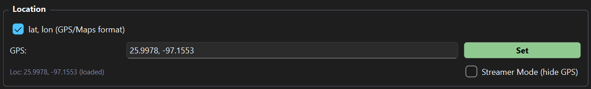

*The **Location** panel - top row, right of Connection. The `lat, lon (GPS/Maps format)`
checkbox switches between one paste-ready combined field and separate lat/lon fields; Streamer
Mode masks the values everywhere they could appear on screen.*


*The whole GUI on startup (not yet connected) - the Location panel is top-center.*

- **`lat, lon (GPS/Maps format)`** - one paste-ready field, exactly what Google Maps gives you
  when you right-click a spot and copy coordinates (e.g. `25.9978, -97.1553` for Starbase,
  Texas, which is what this repo ships with).
- **Set** - pushes the typed location to the Arduino immediately (and it's auto-sent on every
  connect anyway). Typing alone also saves it (debounced) - the Set button is just for pushing
  it to the mount right now.
- **Streamer Mode (hide GPS)** - masks the coordinates in the fields, the location label and the
  message log (bullets instead of digits). The underlying values keep working: syncs, Sun/Moon
  positions etc. are unaffected. For streams/screenshots you don't trust.

Location matters for: the local horizon drawn on the sky map, Local Sidereal Time (star
positions relative to the horizon), Sun/Moon/planet rise/set behavior, and ISS visibility.

## 4. Launching

Double-click **`launch_gui.bat`** - it launches the GUI detached (no console window).

Or manually:

```bash
.venv\Scripts\python.exe trackerGui.py
```

## 5. Connecting to the mount

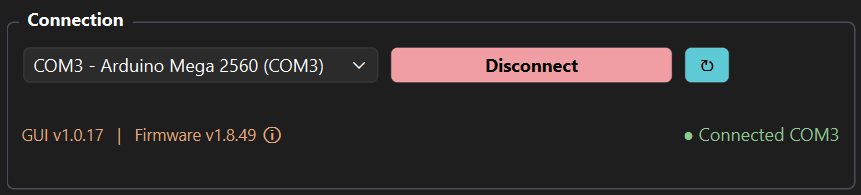

*The **Connection** panel while connected: the green **Connect** has flipped to a red
**Disconnect**, the status dot is green, and the version line reads `GUI v1.0.17 | Firmware
v1.8.49` - shown orange here, see the version bullet below.*

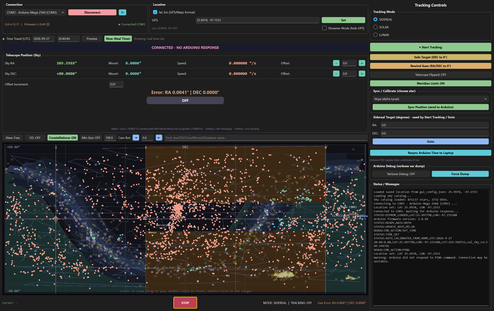

*The whole GUI in the connected state - Connection is top-left.*

1. Plug in the Arduino's USB, power the mount's motors.
2. Pick the port in the **Connection** dropdown (`↻` refreshes the list) and click **Connect**.
   On success the button flips to a red **Disconnect**, the status line goes green, and every
   mount-dependent control un-grays.

On connect the GUI automatically:

- pings the board and displays its firmware version next to the GUI version (orange + an ⓘ
  tooltip if the flashed firmware differs from this repo's `EQMountTracker.ino` - i.e. your
  board is stale, reflash it),
- sends the current time and your location (that's the Arduino's clock and observer position
  for all its on-board math),
- re-sends your RA/DEC sync offsets and the meridian-limit setting,
- starts listening to the 50 Hz position stream.

The Arduino is deliberately **not reset** when the GUI connects/disconnects (DTR/RTS held
inactive), so you can close and reopen the GUI - or connect a different one - without losing the
mount's calibration or tracking state.

## 6. The sky map

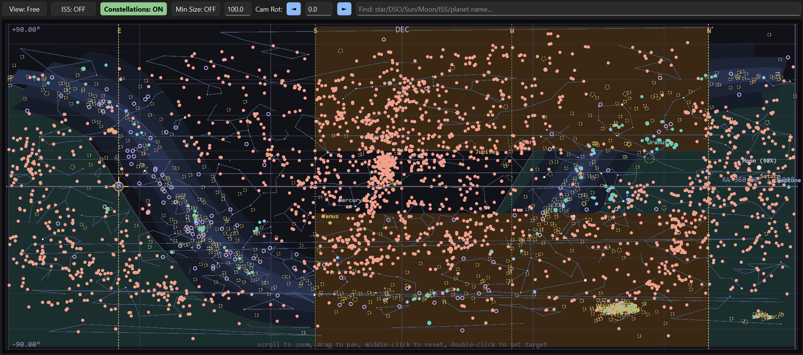

*The sky map with its toolbar: view-mode / ISS (now the Vehicles menu) / constellations /
min-size toggles, camera
rotation, and the Find box. The blue rectangle is the camera FOV at the telescope's pointing;
the shaded region is the meridian-limit zone; the curved dimming at the bottom is below your
local horizon.*


*The whole GUI - the sky map occupies the left column, under the position readouts.*

The big OpenGL canvas is a live planetarium of the whole sky, centred on your telescope:

- **871,137 stars** (AT-HYG, complete to magnitude +11), **3,732 deep-sky objects** (all 110
  Messier plus every visual NGC/IC type brighter than mag 13), drawn with realistic colors and
  sizes, **constellation lines**, and an analytically-drawn **Milky Way** band.
- Your **local horizon** (things below it are dimmed), the **meridian-limit danger zone**
  shading, **Sun/Moon/planets** with the Moon drawn at its real phase and lit side, and the
  **ISS**, **Crew/Cargo Dragons** and **Starships** in flight (picked in the Vehicles menu).
- The blue rectangle is your **camera's field of view**; the reticle is the current target.
  Scroll to zoom, drag to pan.

Toolbar:

| Control | What it does |
|---|---|
| **View: Free / Follow Telescope / Follow Target** | Cycles what the map stays centred on. |
| **Vehicles: …** ▾ | Dropdown with a checkbox per vehicle: the ISS (live TLE) plus every Dragon/Starship currently in flight - see [below](#iss-dragon-and-starship-the-vehicles-menu). Screenshots older than GUI 1.0.18 show the single **ISS: OFF/ON** button it replaced. |
| **Constellations: ON** | Toggles constellation lines. |
| **Min Size: OFF** + value | Only draw stars/DSOs larger than N% of their natural size - cleans up the map when zoomed out. |
| **Cam Rot** ◄ / ► | Rotates the camera-FOV rectangle to match how your camera sits in the focuser. |
| **Find: …** | Live search by star/DSO/Sun/Moon/ISS/Dragon/Starship/planet name. |

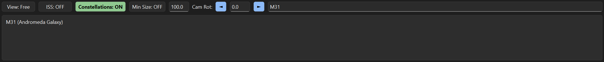

*The **Find** box with a live-filtered results list (query: "M31"). Arrow keys move through the
list; Enter selects.*

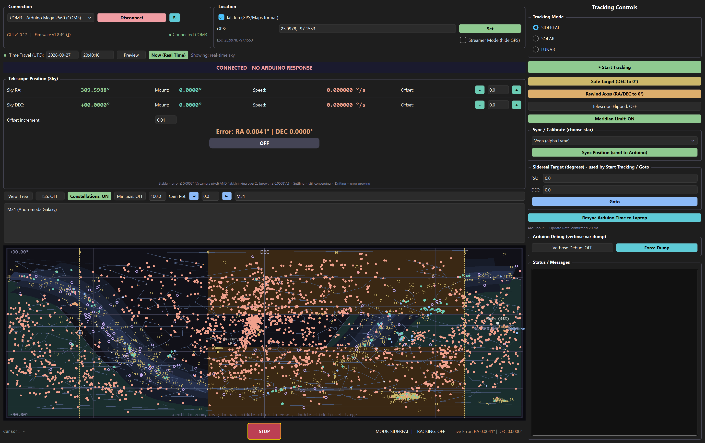

*The whole GUI - the Find results list drops in between the toolbar and the sky map.*

Pick a result and the map jumps to it and offers it as the tracking target. Hovering anywhere
shows the object under the cursor (name, RA/DEC, magnitude) in the bottom-left readout.

### ISS, Dragon and Starship (the Vehicles menu)

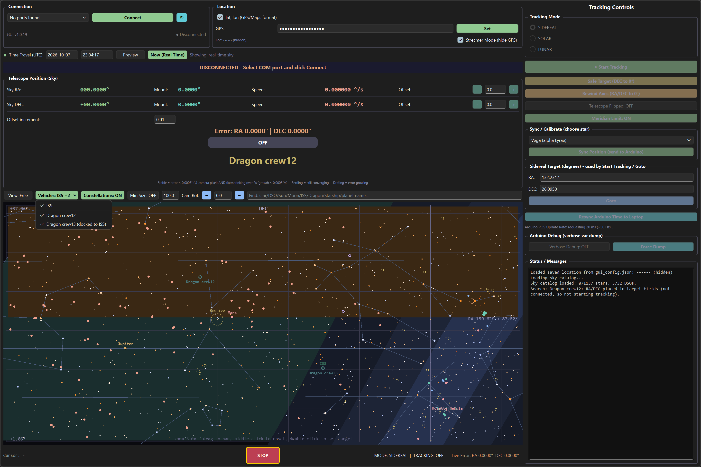

*The **Vehicles** dropdown: the ISS plus every SpaceX vehicle in flight right now - here
Dragon crew12 (free-flying) and Dragon crew13 (docked to the ISS). Starship appears the same way
whenever a ship is actually flying; any number of Dragons and Starships are listed, nothing is
hardcoded to a mission name.*


*The whole GUI with all three shown and Dragon crew12 picked as the target via Find (5x zoom,
not connected). The ISS keeps its circle; SpaceX vehicles are cyan diamonds, labelled below the
marker so a docked Dragon and the ISS don't overprint. Markers dim when the vehicle is below
your horizon.*

Each checked entry gets a live marker; Find also lists every live vehicle by name ("Dragon
crew13", "Starship ship41", ...), and picking one targets and tracks it exactly like the ISS:
SIDEREAL `SET_TARGET` updates at 20 Hz with `CONTINUATION:1`, the firmware extrapolating in
between. Hovering a SpaceX marker shows how old the feed sample behind it is.

Where the positions come from: SpaceX's public vehicle-tracker feeds (the two JSON files behind
spacex.com/vehicle-tracker - unofficial, no key). They hold **one sample per vehicle, refreshed
only about every 30 s**, so the GUI estimates where the vehicle is *now*:

- the velocity at the latest sample is solved from the **previous and latest samples** (shoot a
  velocity guess back to the previous sample under gravity and correct it until it lands),
- then the vehicle is **coasted forward to the current time** (point-mass gravity + J2 in the
  Earth-fixed frame) and converted to topocentric RA/DEC like the ISS,
- Dragon sample times are first **re-anchored against the ISS TLE**: the feed stamps every row
  with the file's generation time, but each row's position belongs to its own telemetry instant,
  seconds off and jittering. Each row also carries the ISS position for that same instant, which
  pins the real time down.
- when a new sample replaces the estimate, the correction is blended in over 5 s so the mount
  sees a smooth rate instead of a jump.

Measured on real data (2026-10-08): predicting the next sample 30 s ahead missed by **0.5-2.5 m**
(a straight-line extrapolation missed by 7.6 km), and the docked Dragon lands within
**0.0015°** of the ISS's own TLE position on the sky.

Limits worth knowing before you point a telescope at one:

- A new vehicle needs **two feed samples** (up to ~1 min) before it can be placed - the menu
  shows "waiting for 2nd sample" until then.
- It is a **coasting** model: during a Starship engine burn or reentry the estimate lags the real
  vehicle until the next sample corrects it.
- The firmware rejects target rates above **3 °/s per axis**
  (`MAX_PLAUSIBLE_TARGET_RATE_DEG_S`). A low Starship pass near the zenith, or anything near the
  celestial pole (where RA rates explode), can exceed that, and that stretch is then not tracked
  smoothly.
- If the tracked vehicle's estimate is **lost** (feed stale or unreachable, the vehicle left the
  feed, a mission-clock reset), the GUI sends one plain `SET_TARGET` at the last position - the
  mount holds that point at sidereal rate - and **does not resume on its own**: resuming would be
  an unattended slew to wherever the vehicle is by then. Stop, then pick it again.
- Vehicles are shown only from samples less than 5 min old, and never extrapolated more than
  5 min - so they disappear in a Time Travel preview, and a leftover post-flight Starship sample
  (the feed keeps the last one for days) is never shown as live.
- The feeds are polled every 30 s while the app runs (every 10 s once a SpaceX vehicle is shown
  or tracked) so the menu stays current; an unchanged file costs a bodiless 304. Offline, the
  failure is logged once, not every poll.

### Zoom

The zoom range runs from the whole sky down to 1000x (~0.4° across). While in View: Telescope
or View: Target the zoom stays anchored on what you're following rather than the cursor, so
the target never leaves the frame. Zoomed onto the Moon you get its real illuminated disc at
true relative scale, onto a planet its disc (Saturn with its rings), onto a star field every
catalog star down to magnitude 11. The sequence below was captured while actually tracking
58 Aquilae:

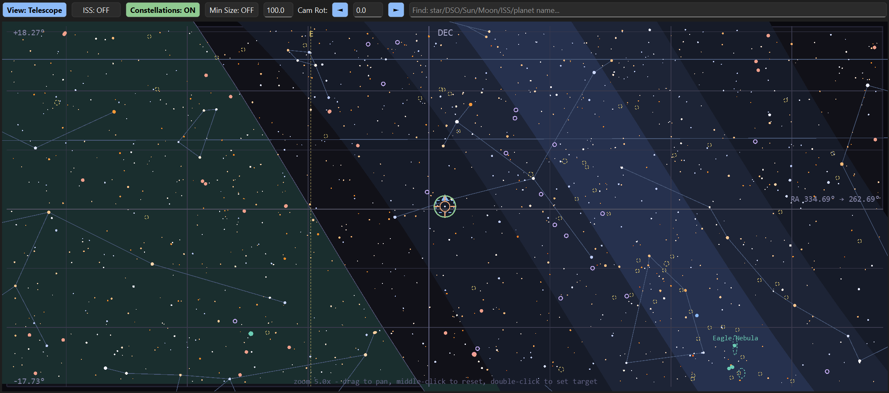

*5x - constellation context around the tracked star (58 Aquilae, in Aquila on the Milky Way
band). The target reticle and camera-FOV rectangle stay centered in View: Telescope mode.*

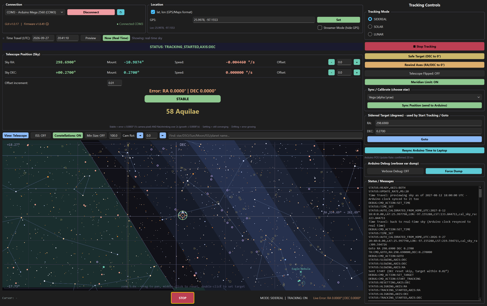

*The whole GUI at 5x.*

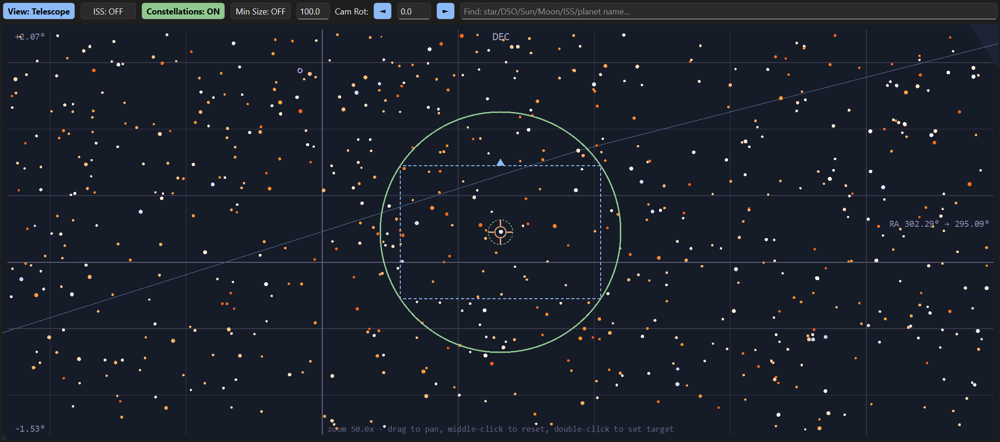

*50x - the field narrows and the FOV rectangle (a real 1.8° x 1.2° camera frame) becomes
readable against the sky.*

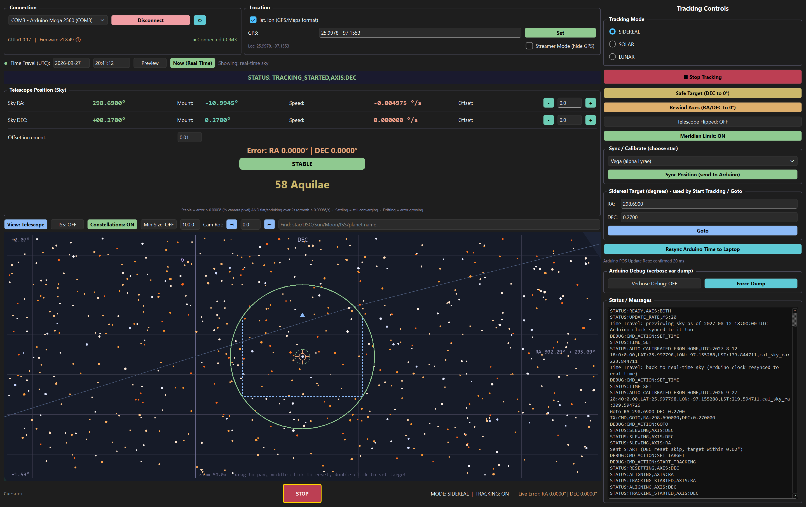

*The whole GUI at 50x.*

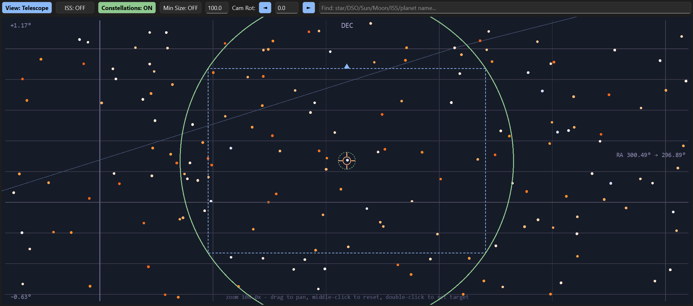

*100x - a telescope-scale field: the FOV rectangle sits mid-view with open sky around
it, and faint magnitude-11 catalog stars populate the field.*

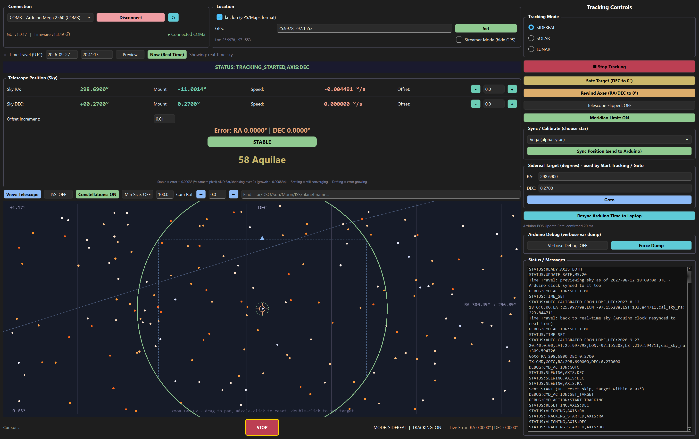

*The whole GUI tracking 58 Aquilae at 100x: MODE: SIDEREAL | TRACKING: ON, the stability
badge green, the reticle locked on the star.*

The Moon pair below was made with the **Time Travel** feature: at capture time the Moon was
below the horizon, so the GUI previewed 2026-10-14 19:00 UTC - a moment when a 16%-illuminated
waxing crescent sits over Starbase - then slewed there and tracked it in LUNAR mode at that
simulated moment.

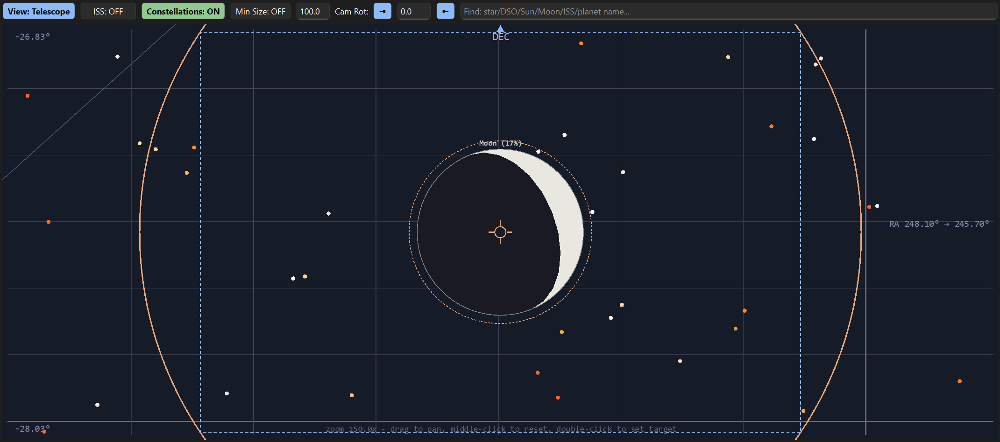

*150x on the Moon while tracking it: a waxing crescent (16% illuminated), lit side drawn from
the real phase geometry. The orange TIME TRAVEL banner at the top of the GUI shows the
simulated time.*

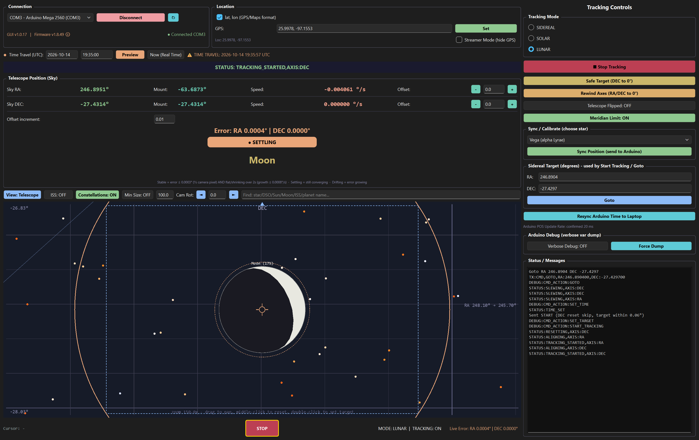

*The whole GUI during the preview: LUNAR mode, TRACKING: ON, the stability badge green, the
sky map at 150x on the Moon, and the orange banner showing the simulated date/time.*

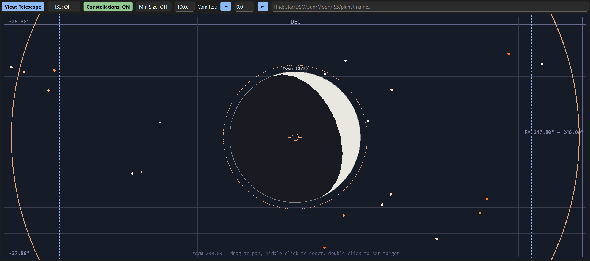

*200x - a closer look at the crescent, the lit limb sharply defined.*

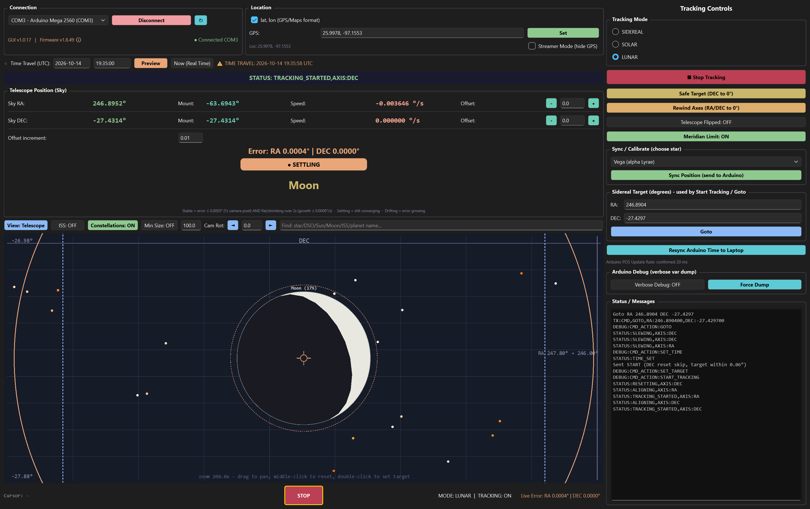

*The whole GUI at 200x on the Moon.*

The **Telescope Position (Sky)** panel under the map is the numerical side of the same story:
where the telescope points (sky RA/DEC after calibration), where the mount's motors physically
are, current axis speeds, your RA/DEC sync offsets (with +/− nudges and an increment), the
pointing error against the target, and the tracking-stability verdict (**Stable / Settling /
Drifting** - stability is judged on a sliding window of the real tracking error, not slew
noise).

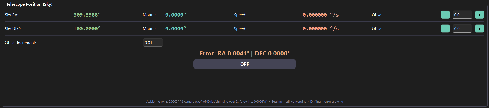

*The **Telescope Position (Sky)** panel in the connected state - the stability verdict badge
is the wide centered field; see [What a track looks like](#what-a-track-looks-like).*


*The whole GUI - the position panel sits directly above the sky map.*

## 7. Tracking controls

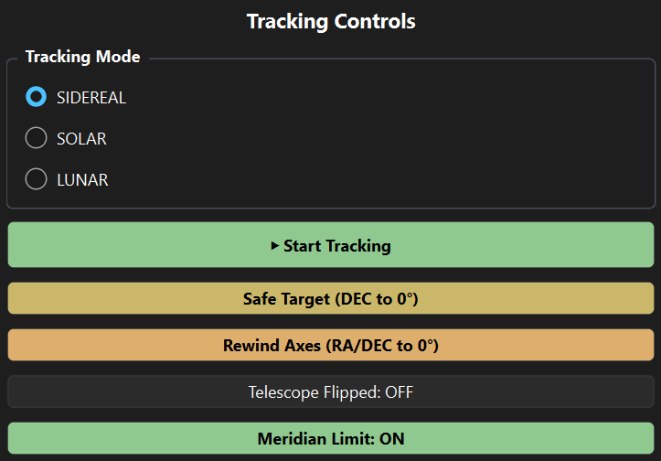

*The **Tracking Controls** sidebar: mode radios, Start/Stop Tracking, Safe Target, Rewind
Axes, Telescope Flipped and the Meridian Limit toggle.*


*The whole GUI - Tracking Controls is the right sidebar, top to the meridian-limit button.*

- **Mode**: SIDEREAL (stars - the default), SOLAR (Sun), LUNAR (Moon). Switching mode while
  tracking stops, re-targets the live body and restarts automatically. SOLAR mode asks for an
  explicit confirmation every time - pointing any telescope at the Sun is a safety gate, not a
  default.
- **▶ Start Tracking** - slew to the current target, then track it. The firmware runs the whole
  alignment sequence itself (slew with acceleration ramp, settle, error report) and the GUI
  shows live progress and the stability trend.
- **■ Stop Tracking** - stop and hold.
- **Safe Target (DEC to 0°)** - moves DEC to the celestial equator, the safe parking position.
- **Rewind Axes (RA/DEC to 0°)** - rewinds both axes to their zero positions.
- **Telescope Flipped: OFF** - tell the firmware when the tube is manually flipped in its
  clamps (e.g. after a meridian passage), so the DEC math stays correct.
- **Meridian Limit: ON** - the firmware refuses slews that would push the mount through the
  meridian into the danger zone (where an EQ mount collides with its own tripod). Turning it
  off requires a confirmation dialog, every time.

The **STOP** button next to the map is the emergency stop: one click, no confirmation, works
even while a slew is in flight (details in [Safety features](#11-safety-features)). The
Delete key does the same.

### Keyboard shortcuts

| Key | Action |
|---|---|
| **Delete** (Suppr on a French keyboard) / **Backspace** | Emergency stop - exactly the red STOP button: unconditional (fires even if the status display is stale), no confirmation, and the button stays visually pressed for as long as you hold the key. Ignored while you are typing in a text field. |
| **Enter** / **Return** | Start / Stop Tracking - same as the tracking button, unless a text field or the Find results list has focus (those keep their own Enter behavior). |
| **Down** while in the Find box | Jump into the results list, top entry selected. |
| **Up** on the list's top entry | Back to the Find box, cursor where you left it. |

### What a track looks like

Once you press **▶ Start Tracking**, the wide badge under the position readouts walks through
the whole story: the slew, the convergence, the verdict.


*ALIGNING (cyan) - the initial slew to the target is in flight.*

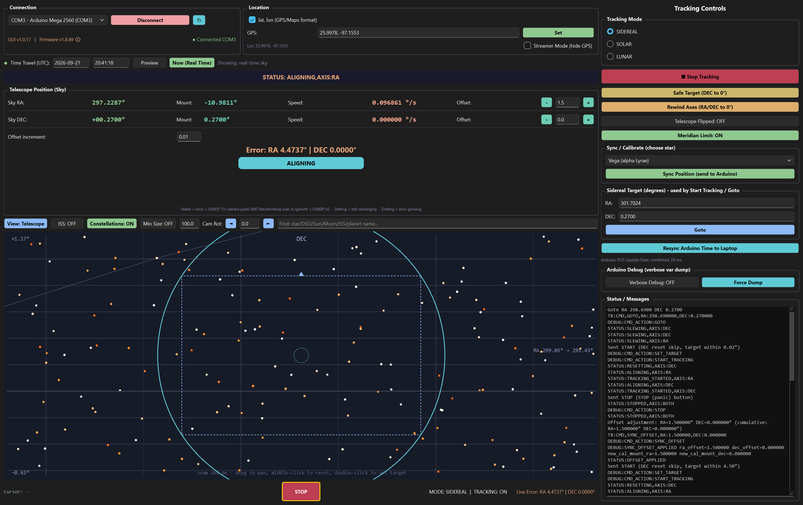

*The whole GUI mid-slew (ALIGNING): the status line reports the axis being aligned, the speed
readouts are live, and the camera-FOV rectangle is on the move.*


*● SETTLING (orange) - tracking has begun, but the pointing error is still above the stable
threshold and converging.*

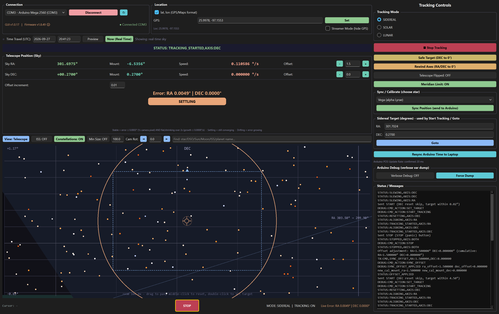

*The whole GUI at that moment - the error readout above the badge still shows the residual
being corrected.*


*STABLE (green) - error at or under half a camera pixel AND flat/shrinking over the trend
window. This is the "ready to image" verdict.*

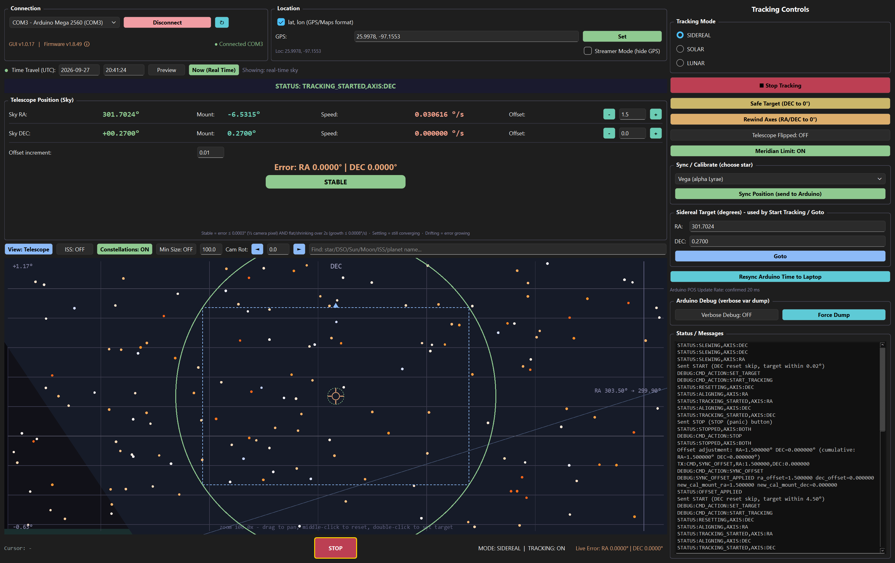

*The whole GUI during a track (STABLE): the mode line reads TRACKING: ON, the live error sits
next to the STOP button, the reticle is on the target, and the badge is green.*


*DRIFTING (red) - the error is growing again (induced here with a small RA offset nudge). The
verdict comes from the error's trend, not just its size, so a small-but-growing error is
flagged before it becomes large.*

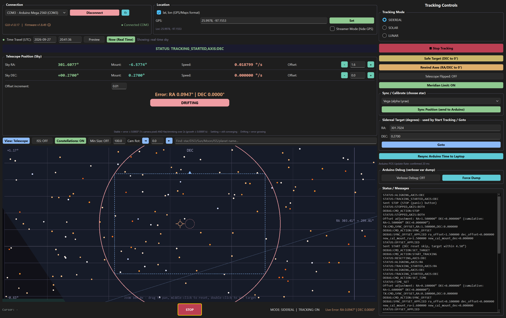

*The whole GUI at that moment - the error readout is visibly non-zero while the badge is red.*

## 8. Sync / Calibrate

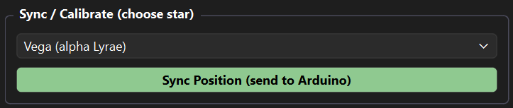

*The **Sync / Calibrate** panel - pick the object the telescope is actually pointing at, then
Sync Position.*


*The whole GUI - Sync / Calibrate is in the right sidebar, under the tracking controls.*

The firmware's pointing model is *mount-relative*: it knows the RA axis's position relative to
home (both axes at 0°), and calibration is the one number that ties "mount RA at home" to the
sky. You can calibrate without ever seeing a star (the firmware auto-calibrates from the home
position + your location + time whenever it gets a fresh time/location pair), but the **Sync /
Calibrate** panel is the accurate way: point the telescope at a known object, pick it in the
dropdown - **Vega, Arcturus, Altair**, the **East/West horizon** (DEC = 0, useful for
re-syncing after a manual re-home without needing a visible star), or **Custom** (the RA/DEC
fields) - and click **Sync Position**. The offset between where the mount thinks it is and the
sky is stored as RA/DEC offsets and applied from then on.

## 9. Targets, Goto and offsets

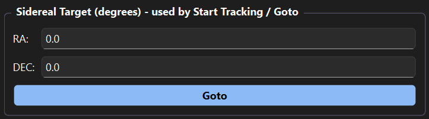

*The **Sidereal Target** panel - the RA/DEC that Goto and Start Tracking aim at, plus the
Resync Arduino Time button.*


*The whole GUI - the target panel is in the right sidebar, under Sync / Calibrate.*

- The **Sidereal Target** RA/DEC fields are where Goto/Start Tracking aim at; picking anything
  in the Find box fills them for you.
- **Goto** slews there without starting to track.
- If the target is in the meridian danger zone, Goto refuses and asks; you can explicitly
  accept the risk (the override is sent as `RISK_OK:1`, so it's always an explicit choice).
- The **+/−** buttons in the position panel nudge the pointing by small offsets (with a
  configurable increment) - for fine framing without touching the physical mount.
- **Resync Arduino Time to Laptop** re-sends the clock (the GUI also auto-resyncs it every
  60 s against PC-clock drift).
- The **Verbose Debug** toggle / **Force Dump** in the Arduino Debug panel turn on the
  firmware's heavy internal-variable dump - the bench-debugging view of the same state.

## 10. Time Travel

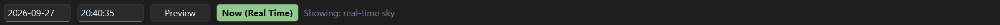

*The **Time Travel** row in its normal, real-time state - the date/time fields tick forward
live with the current UTC, and the label reads "Showing: real-time sky".*

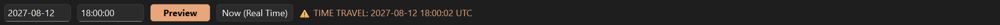

*The same row previewing 2027-08-12 18:00:00 UTC (the total solar eclipse over Spain): the
label flips to an orange "⚠ TIME TRAVEL" banner and the Preview button highlights orange.*

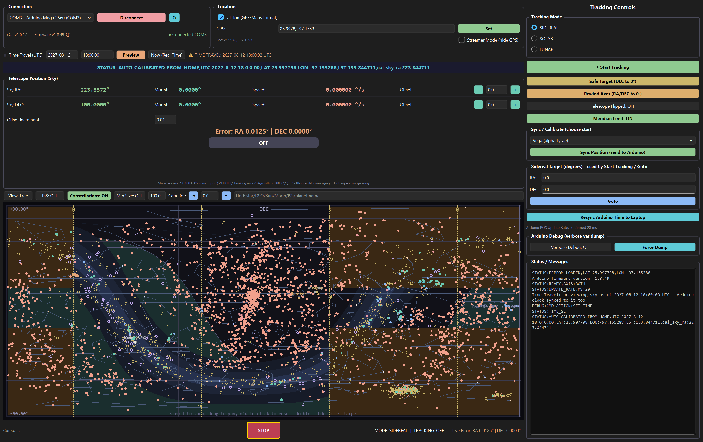

*The whole GUI during the preview - same Time Travel strip as the crop above, banner orange,
with the sky map, horizon and Sun/Moon/planet markers all at the simulated moment.*

Type any **UTC** date/time into the Time Travel fields and hit **Preview**: the whole sky map,
the Sun/Moon/planet/ISS positions - and the Arduino's own clock - jump to that moment. This is
how you rehearse an event (eclipses, conjunctions, ISS passes) in the afternoon and have the
mount already pointing at the right patch of sky. **Now (Real Time)** puts everything back.
Note the fields are interpreted as **UTC** exactly as published astronomical event times are -
no local-timezone conversion happens. Dragon/Starship markers vanish during a preview: their
feeds only describe *now*.

The crescent-Moon zoom shots in [the sky map section](#6-the-sky-map) were made exactly this
way: the Moon was below the horizon at capture time, so the preview jumped to a date when it
was a thin waxing crescent over Starbase.

## 11. Safety features

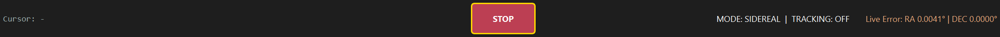

*The emergency **STOP** - red actuator on a yellow-bordered field per ISO 13850, sitting under
the sky map next to the cursor/mode/live-error readouts.*


*The whole GUI - the STOP button is centered in the strip directly beneath the sky map.*

- **STOP button / Delete key** - immediate firmware-level stop; pulse generation zeroes within
  one 50 µs timer tick, independent of whatever the serial link or `loop()` was doing
  (all shortcuts are listed in [Keyboard shortcuts](#keyboard-shortcuts)).
- **Meridian limit** - firmware-side slew refusal in the danger zone; GUI shows the zone
  shaded; disabling needs a per-action confirmation.
- **Solar-mode confirmation** - starting Sun tracking always asks.
- **Risky-slew confirmation** - Goto near/past the meridian asks, and the override is an
  explicit, separate command.
- **Version mismatch warning** - the GUI reads the flashed firmware version and warns when it
  isn't what this repo builds.
- **Streamer Mode** - never leak your coordinates in a stream or screenshot.

## 12. A typical session

1. Set up the mount, roughly polar-align it, both axes at their zero stops, power in.
2. Launch the GUI, check the location, connect.
3. Aim at a known star (or just trust the home auto-calibration), Sync.
4. Find your target in the Find box (or type RA/DEC), Goto, check the framing, Start Tracking.
5. Watch the error/stability readout settle to **Stable** (the badges are shown in
   [What a track looks like](#what-a-track-looks-like)), then image away.
6. STOP or Safe Target when done. The mount keeps its calibration even if you close the GUI.

## 13. Troubleshooting

| Symptom | Likely cause / fix |
|---|---|
| "CONNECTED - NO ARDUINO RESPONSE" | Wrong port, or the board is resetting on open (this GUI holds DTR/RTS inactive precisely to avoid that) - check the cable/port, reflash if the version line stays orange. |
| Slews are slow/vibrating | `MAX_SLEW_SPEED_DEG_S` and `MICROSTEPS` in the `.ino` must match your real hardware - see [Tuning constants](#20-tuning-constants). |
| Pointing is off by a constant amount | Sync on a known star; check the offsets panel; if DEC moves exactly 2× the commanded angle, your DEC gear ratio constant is wrong (it happened here: 65:1 vs 130:1). |
| Sun/Moon/ISS missing | First run needs internet for DE421/TLE; afterwards they're cached (`sky_data/de421.bsp`, `iss_tle.txt`). |
| No Dragon/Starship in the Vehicles menu | Nothing is flying, or no internet (the log says "SpaceX … feed fetch failed" once). A just-appeared vehicle reads "waiting for 2nd sample" for up to a minute. |
| "position estimate lost" while tracking a SpaceX vehicle | The mount is holding the last point at sidereal rate. Stop, then pick the vehicle again once it is back in the Vehicles menu - it never resumes on its own. |
| Sky map empty at startup | Wait for "Sky catalog loaded" in the log; if the catalog is missing run `python sky_data/sky_catalog.py` once. |

The **Status / Messages** log (with the Arduino Debug panel above it) is where all of the above
shows up:

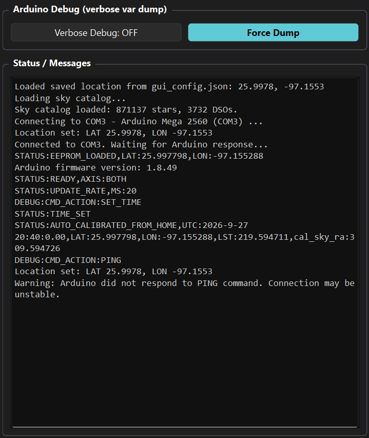

*The **Arduino Debug** and **Status / Messages** panels - every serial line, command and
state transition is logged here; the log is also masked by Streamer Mode.*


*The whole GUI - the log is at the bottom of the right sidebar.*

---

# Part 2 - Technical reference

## 14. System architecture

```
┌──────────────────────────────── PC (Python side) ────────────────────────────────┐
│                                                                                  │
│  trackerGui.py - Qt app (GUI thread)                                             │
│    MainWindow + SkyViewWidget (QOpenGLWidget live sky map)                       │
│        |                                                                         │
│        |  imports          ^ live positions: Sun / Moon / planets / ISS / catalog│
│        v                   | stars, computed by sky_data/ worker threads and     │
│   trackerShared.py         | returned to the GUI as Qt signals:                  │
│     - protocol + math      |   sky_data/sky_catalog.py   (AT-HYG + OpenNGC)      │
│       constants            |   sky_data/solar_system.py  (skyfield + DE421)      │
│     - SerialHandler        |   sky_data/iss_tracker.py   (CelesTrak TLE + SGP4)  │
│       (own thread)         |   sky_data/spacex_tracker.py (SpaceX live feeds)    │
│        |   ^               |                                                     │
│        |   |  RX lines -> queue -> GUI parser                                    │
│        |  CMD,* writes                                                           │
│                                                                                  │
└──────────────────────────────────────────────────────────────────────────────────┘
        v   ^                                                                       
        |   |     USB serial - 250000 baud, plain ASCII text lines                  
        |   |     CMD,* commands down / POS,* at 50 Hz + STATUS:* + DEBUG:* up      
        |   |     (whole lines are atomic since firmware 1.8.54)                    
        |   |                                                                       
┌──────────────────────────────── Arduino Mega 2560 ───────────────────────────────┐
│                                                                                  │
│  EQMountTracker.ino - the whole motion-control brain                             │
│    serial parser / alignment state machine / mount-relative calibration          │
│    on-board LST + Sun (SolTrack) + Moon position math / EEPROM location          │
│        |                                                                         │
│        v  one per axis                                                           │
│    Axis (RA) + Axis (DEC): sky-angle targets, acceleration ramps, backlash       │
│        |  current step rate only - the ramp math stays up here                   │
│        v                                                                         │
│    StepGen: Timer1 (RA) / Timer3 (DEC) 50 us ISRs, DDA step pulse output         │
│        |  STEP / DIR / ENABLE pins (CNC Shield V3 pin map)                       │
│        v                                                                         │
│    CNC Shield V3 + TMC2209 drivers (standalone) + 2 x NEMA17 steppers            │
│                                                                                  │
└──────────────────────────────────────────────────────────────────────────────────┘
```

Design principles that show up everywhere:

- **The firmware is fully self-sufficient.** Once it has time + location, it tracks, slews,
  computes positions and enforces safety entirely on-board. The GUI is a remote control and a
  planetarium, never a required part of the control loop - unplug it mid-session and tracking
  continues.
- **The firmware is never blocked.** No `delay()` anywhere; step pulses come from hardware
  timers, serial I/O is incremental, and even the position broadcast is split across `loop()`
  iterations so no single pass runs long.
- **Everything is sky-angle based.** The interface between GUI and firmware is degrees on the
  sky, never steps or motor units - the gear ratio/microstep math lives in exactly one place
  (`getGearRatio()`).

## 15. Python side

| Module | Role |
|---|---|
| `trackerGui.py` | The whole Qt app: `SkyViewWidget` (a `QOpenGLWidget` planetarium rendering ~875k objects at interactive rates), `MainWindow`, background workers (catalog loader, solar-system computer, ISS thread, SpaceX thread). |
| `trackerShared.py` | Toolkit-agnostic backend: protocol constants, viz/tracking-math constants, and `SerialHandler` - a background thread that owns the `pyserial` port, a write queue, and a reader loop that hands parsed lines to the GUI thread. `GUI_VERSION` lives here. |
| `sky_data/sky_catalog.py` | Builds `sky_catalog.json` from public datasets: **AT-HYG v3.3 reduced_m11** (871,139 stars, mag ≤ 11 + all stars within 100 ly; CC BY-SA 4.0), **OpenNGC** (3,732 visual DSOs: all Messier + NGC/IC types with mag ≤ 13; CC-BY-SA-4.0), and **Stellarium's "modern" constellation lines** (converted from Hipparcos-number polylines). The Milky Way is not data - it's drawn analytically from the IAU 1958 galactic coordinate system. |
| `sky_data/solar_system.py` | Sun/Moon/planet positions, angular sizes, Moon phase and lit-side orientation via **skyfield + JPL DE421**. Lazily imported; takes an `at_time` so Time Travel covers it. |
| `sky_data/iss_tracker.py` | ISS RA/DEC via **CelesTrak GP/TLE** (refreshed every 12 h, cached in `iss_tle.txt`) + skyfield's SGP4 propagation - topocentric, not the sub-satellite point. |
| `sky_data/spacex_tracker.py` | Dragon/Starship from SpaceX's public vehicle-tracker JSON feeds (gzip + ETag): parsing (idle/stale/garbage rows skipped, any number of vehicles), Dragon time anchoring against the ISS TLE, the two-sample velocity solve, RK4 coasting in ECEF (gravity + J2 + Coriolis + centrifugal), handoff blending, and ECEF -> topocentric RA/DEC. |

GUI-side details worth knowing:

- The sky viz refresh cadences are deliberate: Sun/Moon/planets at 1 Hz, ISS and SpaceX
  vehicles at 1 Hz when only displayed (20 Hz when one is the tracked target; the SpaceX feed
  fetch runs on its own thread so a slow request never stalls that), position/FOV follow tied to the 50 Hz POS
  stream, with rescheduling done to wall-clock boundaries so ticks land on a stable phase.
- Tracking stability is computed from the live error history: **Stable** means error below half
  a camera pixel *and* flat/shrinking over the window; the history is reset at the true
  ALIGNING→TRACKING transition so slew noise can't poison the verdict.
- Colors are generated in **OKLCH** space (consistent perceptual lightness across the dark
  theme) except the ISO 13850 STOP button, which is deliberately not themeable.
- The GUI reads the firmware version string and compares against `FIRMWARE_VERSION` parsed
  straight out of this repo's own `.ino` - the mismatch warning is against *your checkout*, not
  a hardcoded number.

## 16. Astronomy pipeline

Position lookups all funnel through one "effective now" (real time or Time Travel), so the map,
the GUI readouts and the firmware's clock can never disagree:

```
observer = Starbase (25.9978, -97.1553)      [gui_config.json]
stars/DSOs: catalog RA/DEC (J2000) vs LST -> hour angle -> horizon mask
Sun/Moon/planets: skyfield(DE421) topocentric -> RA/DEC, size, phase
ISS: TLE -> SGP4 -> topocentric RA/DEC
Dragon/Starship: feed ECEF samples (~30 s apart) -> velocity from the last two -> coast to now -> topocentric RA/DEC
GUI -> CMD,SET_TIME / CMD,SET_LOCATION -> firmware computes LST itself
```

The firmware independently computes Local Sidereal Time, Sun (SolTrack-style algorithm) and
Moon (low-precision ecliptic model → equatorial conversion) so its own tracking rates and
auto-calibration don't depend on the GUI being connected.

## 17. Firmware design

`EQMountTracker.ino` + `Axis.{h,cpp}` + `StepGen.{h,cpp}`, ≈4,000 lines, zero external libraries.

### Step generation (the interesting part)

The step-pulse architecture went through three designs; the current one is the one that works:

1. **AccelStepper polled from `loop()`** (≤ 1.8.21): any long `loop()` work (a
   `Serial.print(float)`, a command parse) delayed the next step - audible twitches synced to
   whatever caused the delay.
2. **AccelStepper inside a 100 µs Timer ISR** (1.8.12–1.8.16, reverted): `run()` also recomputes
   the ramp (sqrt/float division) with unbounded cost; whenever a recompute exceeded the ISR
   period, the pending-interrupt flag refired immediately and the ISR ate ~100 % CPU -
   multi-second `loop()` stalls mid-slew, and the "emergency stop takes seconds" bug that first
   looked like a protocol issue.
3. **StepGen** (1.8.22+, current): the GRBL-style split. The **cheap, bounded** part - advance a
   digital-differential-analyzer accumulator on a fixed **50 µs hardware timer tick** (Timer1
   for RA, Timer3 for DEC; Timer0 stays with the Arduino core) and toggle the step pin on
   threshold crossing - runs in the ISR and nothing else does. The **expensive, unbounded**
   part - the sqrt/float ramp math - lives in `Axis::update()`, called from `loop()`, where it
   can take all the time it wants: it only decides the *current step rate*, which the ISR keeps
   executing autonomously between calls. Step timing is therefore immune to `loop()` timing,
   by construction. A fixed tick + accumulator (rather than reprogramming the compare register
   per step) covers the whole dynamic range - ~5,778 steps/s at max slew down to ~2.4 steps/s
   at sidereal rate - with one timer configuration. DIR-pin writes and rate updates happen in
   one atomic critical section (a 1.8.23 fix for occasional wrong-direction steps).

### Axis

`Axis` wraps one worm axis in sky-angle terms: `setTargetPosition()` handles acceleration ramps
and silently takes up configured backlash on direction reversal; position is authoritative in
step counts maintained by the ISR itself. Axis IDs map to the two hardware timers.

### Motion and tracking

- Slew: max **2.5 °/s** sky rate with a 1.25 s acceleration ramp (tuned down from the original
  5 °/s - NEMA17s have a mechanical resonance band around 60–240 RPM and the gearing put the
  old speed right inside it).
- Tracking rates: sidereal 0.004178 °/s, solar and lunar variants; rate derivation for live
  bodies (ISS, Dragon, Starship) happens in the firmware, extrapolating between SET_TARGET updates, so smoothness
  doesn't depend on the GUI's send rate.
- Alignment state machine: slew → settle → error report → track, with lead-time compensation;
  START/STOP actions are confirmed by the firmware (the GUI retries until it sees the
  confirmation line, so a lost line can't leave the two sides disagreeing about state).

### Calibration model

Mount-relative: RA zero = home stop, DEC zero = home stop; one calibration constant
(`cal_sky_ra`) ties mount-RA to the sky, derived from (time, location) at home or locked in by
a real sync. `CMD,SYNC`/`CMD,SYNC_OFFSET` lock it; fresh `SET_TIME`/`SET_LOCATION` pairs freely
re-derive it until locked - this closes a startup race where the calibration used a stale
location because the two commands arrive as separately-timed serial lines.

## 18. Serial protocol

250000 baud, plain ASCII lines. GUI → firmware commands (all prefixed `CMD,`, found anywhere in
the buffer so stale partial lines can't eat one):

| Command | Meaning |
|---|---|
| `CMD,PING` | Liveness check. |
| `CMD,MODE,SIDEREAL/SOLAR/LUNAR` | Select tracking mode. |
| `CMD,START_TRACKING[,SKIP_DEC_RESET][,RISK_OK:1]` | Slew to target and track. |
| `CMD,STOP` | Stop everything (also a dedicated single-byte panic sentinel, checked before line parsing). |
| `CMD,GOTO,RA:…,DEC:…[,RISK_OK:1]` | Slew to a position without tracking. |
| `CMD,SET_TARGET,RA:…,DEC:…[,CONTINUATION:1]` | Set the tracked target. Sent continuously for the ISS/Dragon/Starship with `CONTINUATION:1` (same object refreshed, so the firmware derives a rate); without it, a fresh fixed target (rate reset to 0). |
| `CMD,SYNC,RA:…,DEC:…` / `CMD,SYNC_OFFSET,RA:…,DEC:…` | Calibration sync / nudge offsets. |
| `CMD,SET_TIME,Y:…,M:…,D:…,h:…,min:…,s:…` | Set the board clock. |
| `CMD,SET_LOCATION,LAT:…,LON:…` | Set observer location. |
| `CMD,SET_FLIPPED,0/1` | Tube manually flipped in clamps. |
| `CMD,SAFE_TARGET` / `CMD,HOME_AXES` | DEC to 0° / rewind both axes. |
| `CMD,SET_POS_UPDATE,MS:…` | POS broadcast period (10–5000 ms; the GUI uses 20 ms). |
| `CMD,SET_MERIDIAN_LIMIT,ENABLED:0/1` / `CMD,QUERY_MERIDIAN_LIMIT` | Meridian safety toggle/query. |
| `CMD,SAVE_LOCATION_EEPROM` / `CMD,LOAD_LOCATION_EEPROM` / `CMD,QUERY_LOCATION` | EEPROM location persistence. |
| `CMD,DEBUG,ON/OFF/DUMP` | Verbose internal-state dump for bench debugging. |

Firmware → GUI: `POS,<skyRA>,<skyDEC>,<targetRA>,<targetDEC>,<mountRA>,<mountDEC>,<mode>,<tracking>,<flipped>`
(mode `S`/`O`/`L`, tracking/flipped as `0`/`1`) at 50 Hz - the GUI derives the displayed axis
speeds from the mount-angle deltas - plus `STATUS:` lines - `READY`, `FIRMWARE:`, `TIME_SET`, `LOCATION_SET`,
`EEPROM_LOADED/SAVED/EMPTY`, `SYNCED`, `AUTO_CALIBRATED_FROM_HOME`, `OFFSET_APPLIED`,
`MERIDIAN_LIMIT_ENABLED`, `SLEWING`, `SLEW_STOPPED`, `ALIGNING`, `TRACKING_STARTED`, `STOPPED`,
`WAITING`, `ERROR`… - and `ERROR:` lines
for refusals (e.g. meridian-limit rejections). The broadcast is split into one-field-per-`loop()`
states and snapshotted at the start so a POS line is internally consistent even though it is
transmitted across several iterations.

**Line atomicity (firmware 1.8.54):** because a POS line spans several loop() iterations, a
status printed while one is mid-flight used to land inside it on the wire
(`POS,322.6218STATUS:TRACKING_STARTED,AXIS:DEC`), and the GUI dropped the pair as a malformed
POS line - at 50 Hz that silently ate roughly half of all statuses, most visibly the final
`TRACKING_STARTED` of an alignment (the stability badge stuck on ALIGNING while tracking
actually ran fine). The firmware now finishes any in-flight POS line before printing another
whole line (`completePendingPosLine()`), and the GUI additionally recovers such hybrid lines
from pre-1.8.54 boards.

## 19. EEPROM persistence

The board stores the observer location (and a magic byte) in EEPROM so a standalone session
remembers where it is. At boot it loads and reports `STATUS:EEPROM_LOADED,LAT:…,LON:…` (or
`EEPROM_EMPTY`, in which case the compile-time default - Starbase - applies until the GUI
sends a real one). The GUI pushes `SET_LOCATION` on every connect; saving to EEPROM is explicit
(`SAVE_LOCATION_EEPROM`) so a temporary location can't silently overwrite your stored one.
Calibration, flip state and tracking state deliberately live in RAM only and survive GUI
reconnects (no DTR reset), not power cycles.

## 20. Tuning constants

All in the `CONFIGURATION` block at the top of `EQMountTracker.ino`:

| Constant | Value (this build) | Notes |
|---|---|---|
| `PIN_STEP/DIR_RA`, `PIN_STEP/DIR_DEC`, `PIN_ENABLE` | 2/5, 4/7, 8 | CNC Shield V3 mapping, X = RA, Z = DEC. |
| `RA_MECHANICAL_RATIO` / `DEC_MECHANICAL_RATIO` | 130.0 / 65.0 | EQ3-2 worm wheels. **Must match your mount** - a wrong ratio shows up as exact-multiple pointing errors (this repo's DEC was 2× until the 65:1 wheel was confirmed). |
| `MICROSTEPS` | 64 | Must match the physical MS1/MS2 jumper state. TMC2209 standalone truth table: `LL→8, HL→32, LH→64, HH→16` (not the A4988 table silkscreened on the shield!). `TRACKING_/SLEW_MICROSTEPS` are aliases until UART control returns (see TODO.md). |
| `RA/DEC_BACKLASH_DEG` | 0.0 | Measured per the comment in `Axis::setBacklash()`; applied automatically on direction reversal. |
| `MAX_SLEW_SPEED_DEG_S` | 2.5 | Keep below the motor's resonance band; see the long comment for the RPM math. |
| `SERIAL_BAUD` | 250000 | |
| `DEFAULT_LAT/LON` (Python, `trackerShared.py`) | 25.9978 / -97.1553 | Fallback only; `gui_config.json` wins. |

## 21. Files, config and logs

| Path | What it is |
|---|---|
| `trackerGui.py` / `trackerShared.py` | GUI / shared backend. |
| `EQMountTracker/` | Arduino sketch (`EQMountTracker.ino`, `Axis.*`, `StepGen.*`). |
| `sky_data/` | Astronomy modules (catalog, solar system, ISS, SpaceX) + built catalog (`sky_catalog.json`), cached ephemeris (`de421.bsp`), ISS TLE cache (`iss_tle.txt`). |
| `gui_config.json` | The one saved setting: your `"lat, lon"` string (ships as Starbase, `25.9978, -97.1553`). |
| `launch_gui.bat` | Detached launcher (uses `.venv\Scripts\pythonw.exe`). |
| `requirements.txt` | `pyserial>=3.5`, `skyfield>=1.49`, `PySide6>=6.5.0`. |
| `assets/Images/` | Screenshots used by this README. |
| `tracker_log.txt`, `launch_log.txt` | Session logs (serial traffic, GUI events). |
| `test/` | Bench tests - see below. |
| `CLAUDE.md` / `TODO.md` | Working agreement / open engineering notes. |

## 22. Testing

`test/` contains the bench suite accumulated during development: firmware-compilation
consistency checks, protocol/EEROM-flow simulations, GPS parsing and config-saving tests,
tracking math verification (the DEC-reset-skip rules), reconnection/timeout handling, and
verification scripts for the offset fixes. They are plain scripts (`python test\test_….py`)
rather than a pytest suite; several exercise the protocol with a simulated Arduino, so they run
without hardware. `test\test_spacex_tracker.py` checks the Dragon/Starship estimator against
real recorded samples and synthetic orbits (run it with `.venv\Scripts\python.exe`). Note they
date from various points in the GUI's Tkinter→Qt history - the
canonical "does it work" test is the real mount.

## 23. Versioning conventions

Two independent versions, both bumped on every functional change with a one-line changelog
entry in the comment block directly above (the full history of *why* lives in those entries -
they're worth reading):

- `GUI_VERSION` in `trackerShared.py` - currently **1.0.19**
- `FIRMWARE_VERSION` in `EQMountTracker.ino` - currently **1.8.54**

The GUI compares the board's reported firmware version against the `.ino` in your checkout and
warns on mismatch - keeping both sides in sync (reflash after changing firmware) is the point
of the whole scheme.
